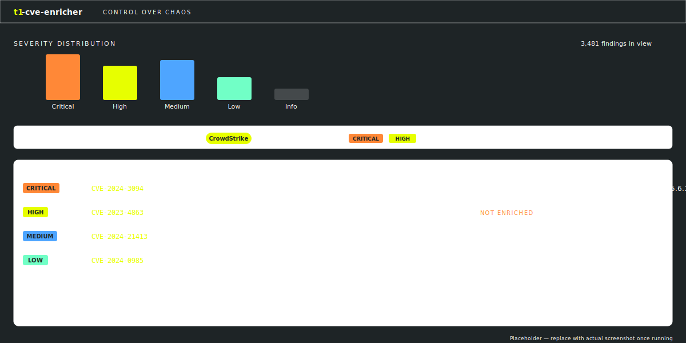

# t1-cve-enricher

> Adds Tenable's CVE intelligence to third-party findings ingested into Tenable One.

[](https://www.python.org/downloads/)
[](https://fastapi.tiangolo.com/)
[](https://react.dev/)
[](LICENSE)
[](https://github.com/astral-sh/ruff)

## The problem

Tenable One ingests findings from third-party security tools (EDR, CSPM, cloud, SCA, etc.) so customers can see their full exposure picture in one place. When those third-party tools report findings as CVE identifiers, the CVEs arrive **without** Tenable's enrichment — no Vulnerability Priority Rating, no remediation guidance, no exploit context. Customers know they have CVE-2024-XYZ on hundreds of assets, but they're missing the "what do I do about it" half of the picture.

**`t1-cve-enricher` closes that gap.** It pulls CVE-shaped findings from third-party connectors in Tenable One, looks each CVE up against Tenable's public CVE database, joins the two, and presents an enriched view that's filterable, exportable, and ready to act on.



## What it does

1. **Discovers** active third-party data sources in your Tenable One inventory
2. **Extracts** CVE-shaped findings from each source
3. **Enriches** each unique CVE with description, CVSS, VPR, and remediation guidance pulled from `tenable.com/cve/{CVE-ID}`
4. **Joins** assets, findings, and CVE intelligence in a local SQLite store
5. **Serves** a filterable web UI with JSON / CSV export and a severity-distribution header chart that updates as you filter

Runs daily by default, on-demand on request.

## Architecture at a glance

```
┌─────────────────┐
│   Tenable One   │◄────┐
│   (your TVM)    │     │ API
└─────────────────┘     │
                        │
┌─────────────────┐  ┌──┴─────────────────────────────────────────┐
│  tenable.com/   │  │              Pipeline (Python)              │
│      cve/       │◄─┤  Source discovery → Findings extraction →   │
└─────────────────┘  │  CVE enrichment (cached) → Join → SQLite    │
                     └────────────────────┬──────────────────────────┘
                                          │
                                          ▼
                                  ┌──────────────┐
                                  │   FastAPI    │
                                  └──────┬───────┘
                                         │
                                         ▼
                                  ┌──────────────┐
                                  │  React UI    │
                                  │  (Vite/TS)   │
                                  └──────────────┘
```

See [`ARCHITECTURE.md`](ARCHITECTURE.md) for the full pipeline, data model, and design decisions.

## Quick start

### Prerequisites

- Python 3.11+
- Node.js 20+
- A Tenable One tenant with API keys (Access Key + Secret Key)
- A user account with permission to read inventory assets and findings

### 1. Clone and configure

```bash
git clone https://github.com/nreynolds-pub-git/t1-cve-enricher.git
cd t1-cve-enricher
cp .env.example .env
```

Edit `.env` and fill in your Tenable API credentials.

### 2. Install and run (Docker)

The fastest path is `docker-compose`:

```bash
docker-compose up --build
```

The UI is then at <http://localhost:5173> and the API at <http://localhost:8000>.

### 3. Or run locally without Docker

```bash
# Backend
make install-backend
make run-backend     # FastAPI on :8000

# Frontend (in a second terminal)
make install-frontend
make run-frontend    # Vite dev server on :5173
```

### 4. Trigger an initial pull

The scheduler runs daily at 02:00 local time by default. To populate the DB immediately:

```bash
make pull            # equivalent to: python -m t1_cve_enricher.workers.scheduler --run-now
```

Open the UI, pick a source from the filter bar, and you should see enriched findings.

## Configuration

All configuration is via environment variables. Copy `.env.example` to `.env` and fill in:

| Variable | Required | Description |
|---|---|---|
| `TENABLE_ACCESS_KEY` | yes | API access key from your TVM user profile |
| `TENABLE_SECRET_KEY` | yes | API secret key |
| `TENABLE_BASE_URL` | no | Defaults to `https://cloud.tenable.com` |
| `DATABASE_PATH` | no | SQLite file location (default: `./data/enricher.db`) |
| `CVE_CACHE_TTL_DAYS` | no | How long to trust a cached CVE record (default: `7`) |
| `SCRAPER_USER_AGENT` | no | Identifies the tool to tenable.com (default sensible) |
| `SCRAPER_RATE_LIMIT_RPS` | no | Requests per second to tenable.com (default: `2`) |
| `SCHEDULE_CRON` | no | Cron expression for the daily pull (default: `0 2 * * *`) |
| `REQUESTS_CA_BUNDLE` | no | Path to corporate cert bundle (Netskope etc.) |

## Behind a corporate proxy or SSL-inspecting gateway

If you're behind Netskope, Zscaler, or similar:

```bash
export REQUESTS_CA_BUNDLE=/path/to/combined-ca-bundle.pem
export SSL_CERT_FILE=/path/to/combined-ca-bundle.pem
```

The HTTP clients in this project respect both. For container deployments, mount the cert bundle into the container and set the env vars in `docker-compose.yml`.

## Development

```bash
make lint        # ruff + mypy + eslint
make test        # pytest backend + vitest frontend
make format      # ruff format + prettier
```

The Makefile is short and self-documenting — run `make` with no arguments for the list.

## How the CVE enrichment works

We don't have access to Tenable's Vulnerability Intelligence API, so this project scrapes the public CVE pages at `https://www.tenable.com/cve/{CVE-ID}`. Behavior:

- Every CVE lookup is **cached** in SQLite, so the same CVE is fetched at most once per `CVE_CACHE_TTL_DAYS`
- The scraper is **rate-limited** (default 2 req/s) and identifies itself in the `User-Agent`
- A custom `Retry-After` header is respected
- If the scraper fails for a given CVE, the finding still appears in the UI with a `not enriched` flag — the rest of the pipeline keeps moving

This is the right design even when an API does become available later: cache once, reuse many, fail soft.

## Roadmap

- [ ] Initial release: discovery, extraction, enrichment, filterable UI, JSON/CSV export
- [ ] Replace scraper with Vulnerability Intelligence API once available
- [ ] Asset detail drilldown (per-asset finding history)
- [ ] **Agentic layer**: natural-language query over the joined dataset ("show me critical findings on CrowdStrike assets with no remediation guidance")
- [ ] **Agentic layer**: Claude-synthesized remediation summaries when Tenable's CVE page is sparse
- [ ] Trend deltas: new vs. resurfaced vs. fixed since last run
- [ ] Slack / email digest of newly-enriched critical findings

## License

MIT — see [LICENSE](LICENSE).

## Disclaimer

This is an independent tool that consumes data from Tenable One via supported APIs and from public CVE pages on `tenable.com`. It is not officially supported by Tenable. CVE intelligence is fetched from publicly accessible pages and cached locally to minimize load on the source.
